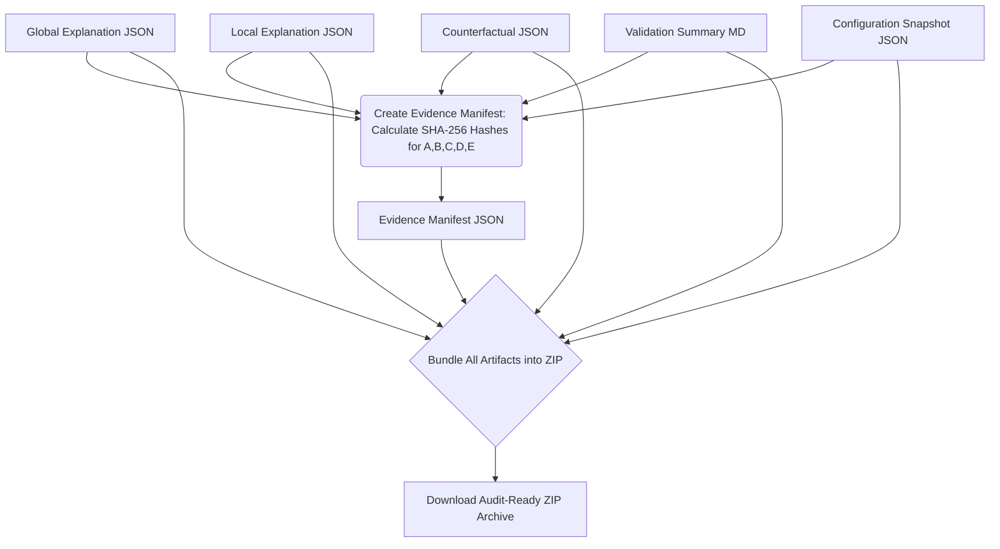

id: 69711d63af3b3d8cb59d8477_documentation
summary: Lab 5: Interpretability & Explainability Control Workbench Documentation
feedback link: https://docs.google.com/forms/d/e/1FAIpQLSfWkOK-in_bMMoHSZfcIvAeO58PAH9wrDqcxnJABHaxiDqhSA/viewform?usp=sf_link
environments: Web
status: Published
# QuLab: Interpretability & Explainability Control Workbench Codelab

## 1. Introduction: The Imperative of Explainable AI in Finance
Duration: 05:00

<aside class="positive">
  This initial step provides crucial context. Understanding the <b>"why"</b> behind explainable AI, especially in regulated industries like finance, will help you grasp the value and purpose of each feature in this application.
</aside>

In the rapidly evolving landscape of artificial intelligence, particularly in sensitive sectors like banking and finance, the ability to **understand**, **interpret**, and **explain** model decisions is no longer a luxury—it's a regulatory, ethical, and business imperative. This Streamlit application, "QuLab: Lab 5: Interpretability & Explainability Control Workbench," is designed to empower model validators, like **Anya Sharma** at PrimeCredit Bank, to rigorously assess the transparency, fairness, and compliance of machine learning models.

The primary focus of this codelab and the application itself is the **Credit Approval Model (CAM v1.2)**. Before such a model can be deployed to make critical decisions (like approving or denying loans), it must undergo thorough validation. This involves answering questions like:
*   Why was a specific loan applicant approved or denied?
*   Which factors generally drive the model's decisions?
*   What minimal changes would have altered a denied application to an approved one?
*   Can these explanations be consistently reproduced and audited?

This application serves as a comprehensive workbench to generate, analyze, and document these crucial explanations, transforming complex ML model outputs into **audit-ready artifacts**.

**Key Concepts Explained:**
*   **Model Interpretability:** The degree to which a human can understand the cause of a decision.
*   **Model Explainability:** The ability to explain a model's prediction in human-understandable terms.
*   **Global Explanations:** Understanding the overall behavior and most important features of a model.
*   **Local Explanations:** Explaining individual predictions for specific data instances.
*   **Counterfactual Explanations:** Identifying minimal changes to an input that would flip a model's prediction.
*   **Audit Trail & Reproducibility:** Ensuring that all analyses and explanations can be traced, verified, and reproduced.

By the end of this codelab, you will have a deep understanding of how this Streamlit application facilitates the model validation process using state-of-the-art explainability techniques, and how it addresses the critical need for transparency and trust in AI systems.

## 2. Setting the Stage: Environment Setup and Data Ingestion
Duration: 10:00

The first step in any robust model validation process is to securely load the model and the data it was trained on. This application emphasizes **reproducibility** and **traceability**, crucial aspects for financial audits. This is achieved by fixing a random seed and computing **SHA-256 hashes** for both the model and the dataset.

<aside class="positive">
  Using SHA-256 hashes for both the model and data ensures <b>data integrity</b> and <b>non-repudiation</b>. Any unauthorized modification to either artifact would result in a different hash, providing an immediate audit alert.
</aside>

**Application Flow:**
1.  Navigate to the "1. Upload & Configure" page using the sidebar.
2.  You will find options to either upload your own model (`.pkl` or `.joblib`) and dataset (`.csv`) or load a sample set provided with the application.

```python
# The application's core logic for loading and hashing artifacts:
model, full_data, X, y, model_hash_val_local, data_hash_val_local = load_and_hash_artifacts(
    model_path, data_path, TARGET_COLUMN, RANDOM_SEED
)
```

The `load_and_hash_artifacts` function (from `source.py`) performs the following critical tasks:
*   **Loads the Model:** Deserializes the machine learning model from the specified path.
*   **Loads the Data:** Reads the feature dataset into a pandas DataFrame.
*   **Separates Features and Target:** Divides the dataset into features (`X`) and the target variable (`y`), based on the `TARGET_COLUMN` configured in the application's `source.py` (default `loan_approved`).
*   **Computes Hashes:** Generates a unique SHA-256 hash for both the loaded model file and the data file.
*   **Sets Random Seed:** Ensures consistency in operations like data splitting.

Once loaded, the application stores these artifacts and their metadata in Streamlit's session state, making them accessible across different pages:
*   `st.session_state.model`: The loaded ML model object.
*   `st.session_state.data`: The full raw dataset.
*   `st.session_state.X`: Features DataFrame.
*   `st.session_state.y`: Target Series.
*   `st.session_state.model_hash`: SHA-256 hash of the model file.
*   `st.session_state.data_hash`: SHA-256 hash of the data file.
*   `st.session_state.feature_names`: List of feature column names.
*   `st.session_state.RANDOM_SEED`: The fixed random seed used.

After successful loading, the UI will display the hashes, filenames, random seed, model type, and a preview of the feature data. A training subset `X_train_exp` is also created for generating global explanations.

**Architecture Diagram for Data Ingestion:**

```mermaid
graph TD
    A[User Uploads Model.pkl] --> B(Load Model File)
    C[User Uploads Data.csv] --> D(Load Data File)
    B --> E{Compute SHA-256 Hash for Model}
    D --> F{Compute SHA-256 Hash for Data}
    D --> G(Extract Features X and Target Y)
    E --> H[Store Model Hash in Session State]
    F --> I[Store Data Hash in Session State]
    G --> J[Store X, Y, Feature Names in Session State]
    E & F & G --> K[Initialize SHAP Explainer (TreeExplainer)]
    K --> L[Application Ready for Explanations]
```

This step is crucial because it establishes the foundational integrity and reproducibility needed for all subsequent explanation generations, aligning perfectly with PrimeCredit Bank's stringent audit requirements.

## 3. Unveiling Overall Behavior: Global Model Explanations
Duration: 15:00

As a Model Validator, Anya's initial priority is to understand the **general behavior** of the Credit Approval Model (CAM v1.2). Which features, on average, are most influential in its decisions across all loan applications? Global explanations provide this aggregated view, confirming if the model's overall logic aligns with PrimeCredit's lending policies and domain expertise.

This application leverages **SHAP (SHapley Additive exPlanations)** values, a powerful and theoretically sound method based on cooperative game theory, for global explanations. For tree-based models (like the `RandomForestClassifier` used in the sample), SHAP is particularly effective.

The fundamental idea behind SHAP values is to attribute the prediction of an instance $x$ to its features by considering the contribution of each feature to moving the prediction from the base value (average prediction) to the current prediction. The sum of the SHAP values for all features and the base value equals the model's output for that instance:

$$ \phi_0 + \sum_{{i=1}}^{{M}} \phi_i(f, x) = f(x) $$

where:
*   $\phi_0$ is the expected model output (the base value/average prediction).
*   $M$ is the number of features.
*   $\phi_i(f, x)$ is the SHAP value for feature $i$ for instance $x$.
*   $f(x)$ is the model's prediction for instance $x$.

For global explanations, we aggregate these individual SHAP values. The mean absolute SHAP value for each feature indicates its overall importance.

**Application Flow:**
1.  Navigate to the "2. Global Explanations" page.
2.  Click the "Generate Global Explanations" button. This button is enabled only if a model has been loaded.

This action triggers the `generate_global_shap_explanation` function (from `source.py`):
```python
# Simplified representation of the underlying function call:
global_importance_df, global_shap_values_raw = generate_global_shap_explanation(
    st.session_state.model, 
    st.session_state.X_train_exp, 
    st.session_state.feature_names, 
    st.session_state.explanation_dir
)
```

**Output and Interpretation:**
Upon successful generation, the application displays:
*   **Global Feature Importance Ranking:** A table (`global_importance_df`) listing features by their mean absolute SHAP value, indicating which features have the highest impact.
*   **SHAP Global Summary Plot:** A visual representation (bar plot) of global feature importance. This plot helps visualize which features are most important and their general direction of impact (though bar plots primarily show magnitude).

<aside class="negative">
  If you have a very large dataset, generating global SHAP values can be computationally intensive. The application samples up to 1000 instances from `X_train_exp` for plotting purposes to mitigate this, but actual calculation might still take time.
</aside>

**Interpretation Example:**
If `credit_score` is at the top of the importance ranking and shows a large positive SHAP value, it means a higher `credit_score` generally increases the loan approval probability. This aligns with typical lending criteria and gives initial confidence in the model's sensible behavior.

This global view is crucial for validating the model's alignment with business rules and providing a high-level overview to non-technical stakeholders and auditors.

## 4. Deep Dive into Individual Decisions: Local Explanations for Specific Loan Applications
Duration: 20:00

While global explanations offer a macro view, they don't answer the crucial question: "Why was *this specific* loan applicant approved or denied?" For PrimeCredit Bank, providing clear, defensible reasons for individual decisions to customers and regulators is paramount. Local explanations, specifically SHAP waterfall plots, allow Anya to dissect the contribution of each feature to a particular prediction.

For a specific instance $x$, the SHAP values $\phi_i(f, x)$ quantify how much each feature $i$ contributes to the prediction $f(x)$ compared to the average prediction $\phi_0$. A positive SHAP value for a feature means it pushed the prediction higher (towards approval), while a negative value pushed it lower (towards denial).

**Application Flow:**
1.  Navigate to the "3. Local Explanations" page.
2.  The application displays the first few rows of your feature data (`st.session_state.X`) to help you select instances.
3.  You can select multiple instance IDs (up to 3 is recommended for readability) using the `st.multiselect` widget. The application provides intelligent defaults, suggesting denied, approved, and borderline cases if available.
4.  Click the "Generate Local Explanations" button. This button is enabled only if a model is loaded and instances are selected.

This action triggers the `generate_local_shap_explanations` function (from `source.py`):
```python
# Simplified representation of the underlying function call:
local_explanations_data, shap_explanations_list = generate_local_shap_explanations(
    st.session_state.model, 
    st.session_state.X, 
    st.session_state.instances_for_local_explanation, 
    st.session_state.shap_explainer_for_local, 
    st.session_state.explanation_dir
)
```
The application uses a pre-initialized `shap.TreeExplainer` (stored in `st.session_state.shap_explainer_for_local`) for efficiency, especially with tree-based models.

**Output and Interpretation:**
For each selected instance, the application displays:
*   **JSON Summary:** A detailed JSON object (`local_explanations_data`) summarizing the instance's features, actual prediction, base value, and each feature's SHAP contribution.
*   **SHAP Waterfall Plot:** A visual representation that shows how each feature's value contributes to pushing the model's output from the `base value` (the average prediction) to the `final prediction` for that specific instance. Features pushing the prediction higher are typically shown in blue/positive, and those pushing it lower in red/negative.

**Flowchart for Local Explanations:**

```mermaid
graph TD
    A[Select Specific Instance ID(s)] --> B{Retrieve Instance Data X_i}
    B --> C(Run SHAP Explainer on X_i)
    C --> D[Calculate SHAP Values for Each Feature in X_i]
    D --> E{Generate JSON Explanation Data}
    D --> F{Generate SHAP Waterfall Plot}
    E --> G[Display JSON in Streamlit Expander]
    F --> H[Display Waterfall Plot in Streamlit Expander]
    G & H --> I[Model Validator Interprets Individual Decision]
```

**Interpretation Example:**
For a denied application, a waterfall plot might clearly show a low `credit_score` and a high `debt_to_income` ratio as the dominant negative contributors, pushing the predicted approval probability below the decision threshold. Conversely, for an approved application, high `income` and `employment_duration` could be the primary positive factors.

This level of detail is invaluable for:
*   **Verifying decision logic:** Ensuring specific reasons align with PrimeCredit's policy.
*   **Identifying potential biases:** Checking if any features disproportionately influence decisions in specific cases without valid business rationale.
*   **Providing actionable feedback:** Crucial for communicating with applicants about why their loan was denied.

Local explanations are a cornerstone of model transparency, fulfilling a critical requirement for internal auditors and regulators.

## 5. "What If?": Understanding Counterfactuals for Actionable Insights
Duration: 15:00

Knowing *why* a loan was denied (via local explanations) is important, but for a denied applicant, a more pressing question is often "What could I have done differently?" This is where **counterfactual explanations** provide immense value. They identify the *minimal* changes required to an applicant's features that would flip the model's decision from denial to approval. This insight is not only empowering for customers but also valuable for PrimeCredit Bank in refining lending criteria.

The objective of generating a counterfactual example $x'$ for an original instance $x$ that results in a different prediction $y'$ is to minimize the distance between $x$ and $x'$, subject to the constraint that $x'$ belongs to the feasible input space $\mathcal{{X}}$ and the model $f$ predicts $y'$ for $x'$. This can be formalized as:

$$ \min_{{x'}} \text{{distance}}(x, x') \quad \text{{s.t.}} \quad f(x') = y' \quad \text{{and}} \quad x' \in \mathcal{{X}} $$

where:
*   $\text{{distance}}(x, x')$ is a measure of proximity (e.g., L1 or L2 norm), quantifying how "close" the counterfactual is to the original.
*   $f(x')$ is the model's prediction for the counterfactual instance $x'$.
*   $y'$ is the desired outcome (e.g., loan approval).
*   $x' \in \mathcal{{X}}$ ensures the counterfactual features are plausible and within realistic bounds.

**Application Flow:**
1.  Navigate to the "4. Counterfactuals" page.
2.  The application will automatically populate a dropdown with instance IDs corresponding to **denied** loan applications (where `st.session_state.y == 0`). You must select one of these. If no denied instances are found, a warning will be displayed.
3.  Click the "Generate Counterfactual Example" button. This button is enabled only if a model is loaded and a denied instance is selected.

This action triggers the `generate_counterfactual_explanation` function (from `source.py`):
```python
# Simplified representation of the underlying function call:
counterfactual_data = generate_counterfactual_explanation(
    st.session_state.model, 
    st.session_state.X, 
    st.session_state.feature_names, 
    st.session_state.denied_instance_for_cf_idx, # The selected denied instance
    1, # Desired class (1 for approved)
    st.session_state.explanation_dir
)
```

**Output and Interpretation:**
The application displays a detailed `counterfactual_result` object, which includes:
*   **Original Instance:** The feature values of the denied applicant.
*   **Original Prediction Probability:** The probability of approval for the original instance.
*   **Counterfactual Instance:** The modified feature values that would lead to approval.
*   **Counterfactual Prediction Probability:** The probability of approval for the counterfactual instance (which should be above the threshold for class 1).
*   **Features Changed to Flip Prediction:** A dictionary highlighting precisely which features were changed and by how much.

**Diagram for Counterfactual Generation:**

```mermaid
graph TD
    A[Denied Instance (x)] --> B{Model Predicts: Denied (f(x) = y_denied)}
    B --> C(Define Desired Outcome: Approved (y_approved))
    C --> D[Counterfactual Algorithm]
    D -- Iteratively Adjust x --> E{Find x' such that f(x') = y_approved}
    E -- Minimize Distance(x, x') --> F(Output Counterfactual Instance x')
    F --> G[Highlight Features Changed (x -> x')]
    G --> H[Display Original, Counterfactual, and Changes in UI]
    H --> I[Model Validator Gives Actionable Feedback]
```

**Interpretation Example:**
If the original instance had a `credit_score` of 600 and was denied, the counterfactual might suggest that if `credit_score` were 650 (a change of +50 points) and `debt_to_income` were reduced by 5%, the loan would be approved. This provides concrete, actionable advice.

This functionality empowers PrimeCredit Bank to:
*   **Inform customers constructively:** Provide applicants with specific steps to improve their eligibility.
*   **Refine policy:** Identify consistently critical features, potentially leading to policy reviews.
*   **Assess model sensitivity:** Understand how susceptible the model is to changes in specific features.

Counterfactuals bridge the gap between "why" and "what to do next," making AI systems more helpful and trustworthy.

## 6. Identifying Gaps: Interpretability Analysis and Validation Findings
Duration: 10:00

After generating global, local, and counterfactual explanations, Anya's crucial role as a Model Validator is to synthesize these findings. This involves identifying any **interpretability gaps** that could hinder the CAM v1.2's deployment or introduce risks for PrimeCredit Bank. An interpretability gap might be a statistically significant feature lacking business rationale, inconsistent local explanations for similar cases, or counterfactuals that suggest unrealistic changes.

This step focuses on documenting observations, evaluating the model's transparency, and formulating a recommendation.

**Anya's Analysis Focuses On:**
*   **Coherence with Policy:** Do the explanations consistently align with PrimeCredit's established lending policies and regulations?
*   **Transparency:** Are the reasons for decisions clear, concise, and easily understandable by non-technical stakeholders (e.g., loan officers, customers, auditors)?
*   **Consistency:** Do similar cases receive similar explanations, and are there any anomalous or contradictory explanations?
*   **Actionability:** Do counterfactuals provide practical, achievable advice for applicants?

**Application Flow:**
1.  Navigate to the "5. Validation Summary" page.
2.  Click the "Generate Validation Summary" button. This button is enabled if at least some explanations (global, local, or counterfactual) have been generated.

This action triggers the `generate_explanation_summary` function (from `source.py`):
```python
# Simplified representation of the underlying function call:
summary_content = generate_explanation_summary(
    st.session_state.global_importance_df, 
    st.session_state.local_explanations_data, 
    st.session_state.counterfactual_result, 
    st.session_state.explanation_dir
)
```

**Output and Interpretation:**
The application generates and displays a markdown-formatted report (`explanation_summary_md`) that consolidates findings from all previous explanation steps. This report typically includes:
*   An overview of global feature importance.
*   Summaries of selected local explanation cases.
*   Details of the counterfactual analysis.
*   A section identifying "Interpretability Gaps" (e.g., complex feature interactions, unclear impact of specific features).
*   Recommendations for PrimeCredit Bank based on the findings (e.g., "approve with caveats," "require further model refinement").

<aside class="negative">
  Due to internal design constraints, the model and data hashes displayed directly within the `explanation_summary.md` in the UI are derived from the initial load of sample files in `source.py`. For the <b>actual, verified hashes</b> of *your dynamically uploaded model and data*, always refer to the `config_snapshot.json` file within the final exported artifact bundle (Step 7).
</aside>

This structured summary is a primary artifact for internal audit teams and senior leadership. It demonstrates Anya's comprehensive analysis, highlighting potential risks and providing actionable recommendations for the CAM v1.2's deployment readiness. By clearly documenting these observations, the application enables informed decision-making regarding the model's production use.

## 7. Audit Trail: Reproducibility and Artifact Bundling
Duration: 10:00

The final and most critical step in Anya's model validation workflow is to ensure that all her work is fully reproducible and securely bundled for auditing. For PrimeCredit Bank, regulatory compliance demands an immutable record of all explanation artifacts, along with the configuration and cryptographic hashes that guarantee their traceability to specific model and data versions. This "audit-ready artifact bundle" provides indisputable evidence of the validation process.

This process involves consolidating all generated explanations, configuration details, and a manifest (`evidence_manifest.json`) containing SHA-256 hashes of each file into a single, timestamped ZIP archive.

The SHA-256 hash function takes an input (e.g., a file's content) and produces a fixed-size, 256-bit (32-byte) hexadecimal string. Even a minuscule change to the input will result in a completely different hash, making it an excellent tool for verifying data integrity:

$$ \text{{SHA-256}}(\text{{file\_content}}) = \text{{hexadecimal\_hash\_string}} $$

**Application Flow:**
1.  Navigate to the "6. Export Artifacts" page.
2.  Click the "Generate & Bundle All Audit Artifacts" button. This button is enabled once a model has been loaded.

This action triggers a sequence of functions (from `source.py`):
*   `create_config_snapshot`: This function creates a `config_snapshot.json` file, capturing the model hash, data hash, random seed, and other relevant configuration details from the session state. This file is crucial for reproducing the exact environment and data versions used for validation.
*   `create_evidence_manifest`: This function generates an `evidence_manifest.json`. It iterates through all generated explanation files (global, local, counterfactual, summary, and the config snapshot) and calculates their individual SHA-256 hashes. This manifest serves as a cryptographic record of each artifact's integrity.
*   `bundle_artifacts_to_zip`: Finally, this function collects all the generated files (explanation JSONs, markdown summary, config snapshot, and evidence manifest) into a single, timestamped ZIP archive.

```python
# Simplified representation of the underlying function calls:
# 1. Create a snapshot of the configuration
config_file_path = create_config_snapshot(
    st.session_state.model_hash, 
    st.session_state.data_hash, 
    st.session_state.RANDOM_SEED, 
    st.session_state.explanation_dir
)

# 2. Identify all generated files for bundling
output_files_candidates = [
    os.path.join(st.session_state.explanation_dir, 'global_explanation.json'),
    # ... other explanation files ...
    config_file_path
]
st.session_state.output_files_to_bundle = [f for f in output_files_candidates if os.path.exists(f)]

# 3. Create a manifest of all files with their hashes
manifest_file_path = create_evidence_manifest(
    st.session_state.explanation_dir, 
    st.session_state.output_files_to_bundle
)
st.session_state.output_files_to_bundle.append(manifest_file_path)

# 4. Bundle everything into a ZIP
zip_archive_path = bundle_artifacts_to_zip(st.session_state.explanation_dir, st.session_state.run_id)
st.session_state.zip_archive_path = zip_archive_path
```

**Output and Interpretation:**
Upon successful bundling, the application displays a confirmation message and enables a "Download Audit-Ready Artifact Bundle" button.

<button>
  [Download Audit-Ready Artifact Bundle](javascript:void(0))
</button>

The downloaded ZIP archive contains:
*   `global_explanation.json`: Details of global feature importance.
*   `local_explanation.json`: Details of selected local explanations.
*   `counterfactual_example.json`: Details of the counterfactual analysis.
*   `explanation_summary.md`: The comprehensive validation summary report.
*   `config_snapshot.json`: A snapshot of the model, data hashes, and random seed.
*   `evidence_manifest.json`: The cryptographic manifest linking all files to their SHA-256 hashes.

**Audit Trail Diagram:**



This single, self-contained ZIP archive is PrimeCredit Bank's **audit-ready artifact bundle**. It ensures:
1.  **Reproducibility:** The `config_snapshot.json` captures all parameters needed to regenerate these explanations, including the exact model and data hashes.
2.  **Traceability:** The `evidence_manifest.json` provides cryptographic proof of the integrity and origin of each artifact, linking them directly to the validated model and data versions.
3.  **Compliance:** All necessary documentation for internal auditors, regulators, and senior stakeholders is readily available and verifiable, significantly reducing regulatory risk and building trust in the AI system.

This completes the model validation task, providing PrimeCredit Bank with the necessary confidence to proceed with the CAM v1.2's deployment, knowing its decisions are explainable, transparent, and auditable.
